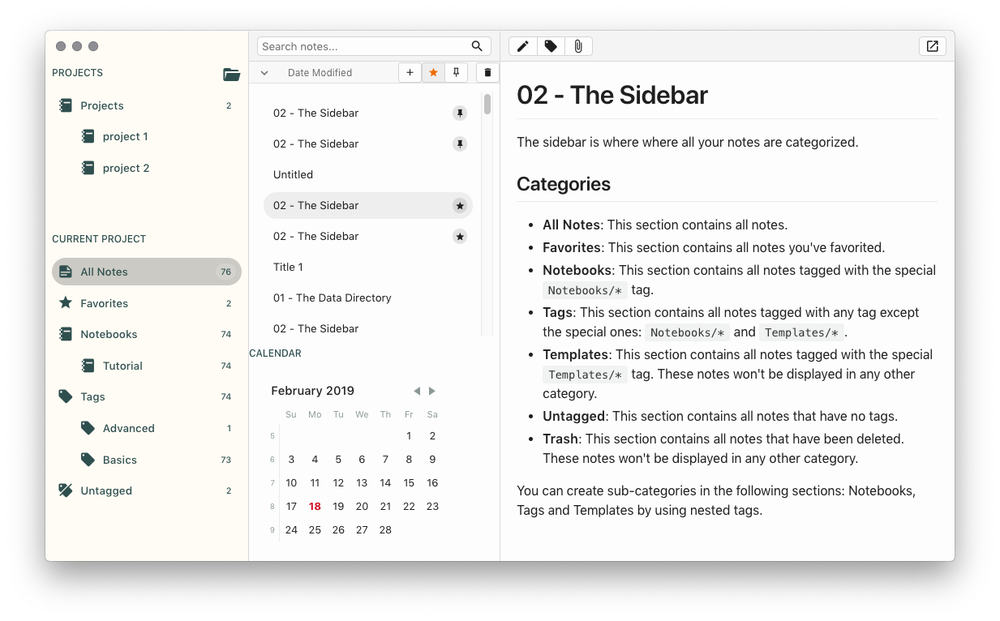
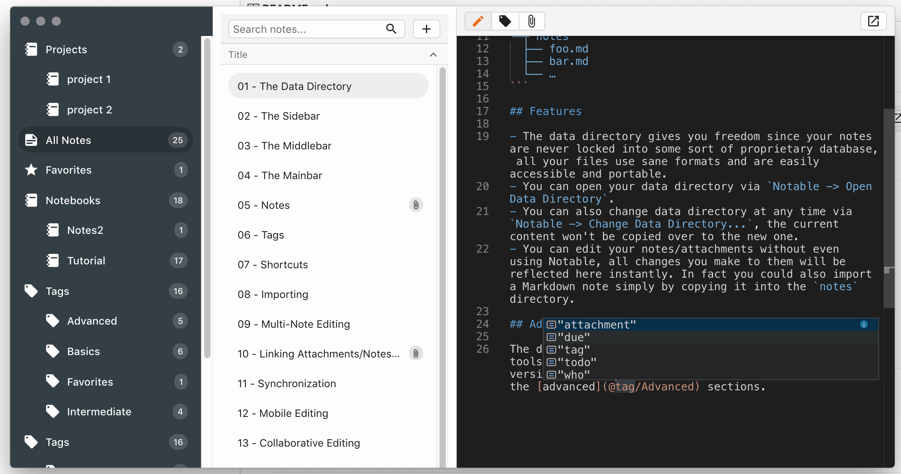

# **Notem**, once a fork of Notable

<p align="center">
  
</p>

## Why a fork

Three years ago I started looking at markdown editors to help with some of my professional project-based workflows. At the time, I was dealing with multiple projects at the same time, many of them having weekly checkpoints involving minutes to be gathered, reviewed and shared. I started taking these notes in individual markdown documents, asking that others in the teams do the same. As the projects went along, managing the documentation became an increasingly burdensome task, and my then-single page editor quickly did not suffice. So I started building a small tool to assist. I am back into a multi-projects environment, and again facing the issue of tracking all this information. Time for a new tool.

I ran into Notable, which had the merrit of being both [Open Source (MIT)](https://github.com/lmihalkovic/notable/blob/v1.3.0/LICENSE)  and with a clean, albeit not suited for my purpose, codebase. This repo is a fork started from v1.3.0 of the great work started by [Fabio Spampinato](https://github.com/fabiospampinato).

I may eventually push it all here, but in the meantime, here are a few of the technical things I am doing under the hood:

* revert the build to the standard [electron-webpack](https://github.com/electron-userland/electron-webpack)
* change the internal data model (eventually with server side support)
* add [RxJS](https://www.learnrxjs.io/) to the dependencies
* remove [CodeMirror](https://codemirror.net/) and replace it with [monaco](https://microsoft.github.io/monaco-editor/)
* change the internal markdown processing workflow
* improve the [monarch](https://microsoft.github.io/monaco-editor/monarch.html) markdown styling
* make all the layout code uniform (svelto gets in the way)

## Features

The original Notable was interesting but it is unfortunately too limited in areas where I have specific needs. So these are things which I am working on

* support working on multiple workbooks/projects
* support notebooks-as-tags & notebook-as-folder inside the same workbook/project
* support new tags (```@todo```, ```@due(date)```, ```@done```)
* add code completion where it makes sense
* show all the relevant dates for a given workbook/project

```
/.../path/to/workbook1
├─┬ attachments
│ ├── foo.ext
│ ├── bar.ext
│ └── …
└─┬ notes
  ├── foo.md
  ├── bar.md
  └── …
/.../path/to/workbook2
├─┬ attachments
│ ├── foo.ext
│ ├── bar.ext
│ └── …
└─┬ notes
  ├─┬ notebook1
  │ └─┬ 01 Specs
  │   ├ foo1.md
  │   └── …
  ├── bar2.md
  └── …
```

- **No proprietary formats**: Notable is just a pretty front-end for a folder structured as shown above. Notes are plain Markdown files, their metadata is stored as Markdown front matter. Attachments are also plain files, if you attach a `picture.jpg` to a note everything about it will be preserved, and it will remain accessible like any other file.

- **Proper editor**: Notable doesn't use any WYSIWYG editor, you just write some Markdown and it gets rendered as GitHub-flavored Markdown. The built-in editor is [CodeMirror](https://codemirror.net), this means you get things like multi-cursor by default. If you need more advanced editing features with a single shortcut you can open the current note in your default Markdown editor.

- **Indefinitely nestable tags**: Pretty much all the other note-taking apps differentiate between notebooks, tags and templates. IMHO this unnecessarily complicates things. In Notable you can have root tags (`foo`), indefinitely nestable tags (`foo/bar`, `foo/.../qux`) and it still supports notebooks and templates, they are just special tags with a different icon (`Notebooks/foo`, `Templates/foo/bar`).

Upon first instantiation, some tutorial notes will be added to the app, check them out for more in-depth details about the app and how to use it. You can also find the raw version [here](https://github.com/fabiospampinato/notable/tree/master/resources/tutorial/notes).

## Fabio's Intro to [Notable](https://github.com/fabiospampinato/notable)

The markdown-based note-taking app that doesn't suck.

I couldn't find a note-taking app that ticked all the boxes I'm interested in: notes are written and rendered in GitHub-flavored Markdown, no WYSIWYG, no proprietary formats, I can run a search & replace across all notes, notes support attachments, the app isn't bloated, the app has a pretty interface, tags are indefinitely nestable and can import Evernote notes (because that's what I was using before).

So I built my own.

## [Comparison](resources/comparison/table.png?raw=true)

[](resources/comparison/table.png?raw=true)

Part of this comparison is personal opinion: you may disagree on the UI front, things I consider bloat may be considered features by somebody else etc. but hopefully this comparison did a good job at illustrating the main differences.

## Demo

### Monaco Editor

<p align="center">
  
</p>

### Indefinitely Nestable Tags


### Editor


### Multi-Note Editor


## Contributing

At the moment this is a closed source work-in-progressm but I am very curious to hear everything you can think about this app, and all the ways in which it would **NOT** work for you.

## License

MIT © L. Mihalkovic, Portions Fabio Spampinato 
